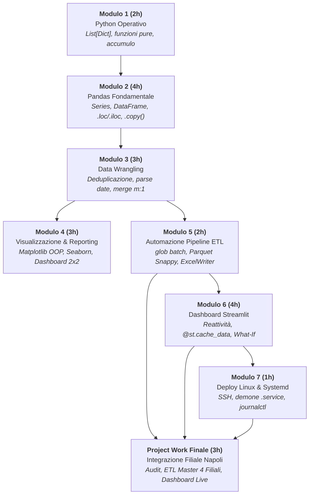

# 🗺️ MAPPA CONCETTUALE E PROGRESSIONE DIDATTICA DEL CORSO
## Corso: Laboratorio Python + Analisi Dati (22 Ore)
### Docente: Arnaldo Morena • ITIS Campobasso

---

## 🧭 Visione d'Insieme & Filosofia Pedagogica
Il corso adotta il modello pedagogico dell'**Apprendimento Progressivo ad Anelli Concentrici**: ogni modulo non è un'isola teorica a sé stante, ma una tessera che riutilizza, rafforza ed estende le competenze acquisite nel modulo precedente, convergendo nell'unico caso aziendale **TechStore Italia**.

---

# 📊 MATRICE DI CORRISPONDENZA COMPETENZE & DELIVERABLE

| Modulo | Concetti Chiave Introdotti | Tool / Librerie | Deliverable Operativo | Connessione Didattica Successiva |
| :---: | :--- | :--- | :--- | :--- |
| **Mod 1** | Tipi primitivi, mutabilità, `List[Dict]`, funzioni pure, accumulo con `.get()`, list comprehension | Python Standard Library (`re`, `math`) | Script calcolo fatturato e sconti riga | Getta le basi concettuali per capire le colonne e le righe di Pandas |
| **Mod 2** | `Series`, `DataFrame`, import Excel, filtri booleani composti, `.loc`/`.iloc`, problema View vs Copy | `pandas`, `openpyxl` | Estrazione Top 10 Deals e filtri canale | Fornisce la grammatica tabellare per manipolare i dati grezzi |
| **Mod 3** | `drop_duplicates()`, imputazione mediane, `parse_data_flessibile()`, `merge(..., validate='m:1')`, feature tempo | `pandas`, `numpy`, `datetime` | Dataset Roma bonificato e arricchito con anagrafica | Produce il dataset pulito indispensabile per la grafica e la pipeline |
| **Mod 4** | Matplotlib OOP (`fig, ax`), Barh con etichette, trend con medie, boxplot Seaborn, heatmap, 300 DPI | `matplotlib`, `seaborn` | File immagine `executive_report.png` (Dashboard 2x2) | Insegna come comunicare visivamente i KPI che andranno nella web app |
| **Mod 5** | Scansione `glob`, esclusione lock file `~$`, pipeline batch, storage Parquet compresso, `pd.ExcelWriter`, `logging` | `glob`, `pyarrow`, `logging`, `argparse` | File `vendite_consolidate_italia.parquet` e report Excel a 4 fogli | Crea il motore di persistenza ad alte prestazioni che alimenta Streamlit |
| **Mod 6** | Esecuzione reattiva top-to-bottom, caching `@st.cache_data`, sidebar, `st.metric`, multi-tab, What-If simulator | `streamlit` | Applicazione web interattiva `dashboard/app.py` | Costruisce l'interfaccia utente finale per il management |
| **Mod 7** | Accesso remoto SSH, unit file Systemd, demone `Restart=always`, gestione `systemctl`, log streaming `journalctl` | Linux OS, Systemd, Bash | Unit file `/etc/systemd/system/dashboard_vendite.service` | Rende la web app persistente e accessibile 24/7 in rete aziendale |
| **PW** | Sintesi completa: audit anomalie, estensione ETL a 4 filiali, verifica dashboard, report direzionale | Stack completo del corso | Dataset Napoli pulito, Master Parquet (4.552 righe), Dashboard con Napoli | Certificazione finale delle competenze professionali (100 pt) |

---

# 🔗 I PONTI CONCETTUALI TRA I MODULI (COSA RICHIAMARE IN AULA)

1. **Dal Modulo 1 al Modulo 2 (Il Ponte dei Dizionari):**
   * *Docente:* Far notare che ogni dizionario di `transazioni` del Modulo 1 è diventato una riga di `df_roma` nel Modulo 2, e le chiavi del dizionario sono diventate i nomi delle colonne.

2. **Dal Modulo 2 al Modulo 3 (Dalla Selezione alla Pulizia):**
   * *Docente:* Nel Modulo 2 abbiamo filtrato i dati presupponendo che fossero puliti. Nel Modulo 3 mostriamo come gestire le celle vuote (`NaN`) e i duplicati che prima avrebbero falsificato i conteggi.

3. **Dal Modulo 3 al Modulo 4 (Dal Dato al Grafico):**
   * *Docente:* I dati aggregati con `groupby('Settore')` nel Modulo 3 diventano i valori graficati sull'asse X o sulle barre orizzontali nel Modulo 4.

4. **Dal Modulo 3/4 al Modulo 5 (Dall'Esplorazione all'Automazione):**
   * *Docente:* Tutto ciò che abbiamo fatto passo-passo nei notebook dei Moduli 2, 3 e 4 viene incapsulato in funzioni automatiche eseguite a ciclo continuo dalla pipeline del Modulo 5.

5. **Dal Modulo 5 al Modulo 6 (Dal File alla Web App):**
   * *Docente:* Il file `vendite_consolidate_italia.parquet` salvato al termine della pipeline è la sorgente dati ad altissima velocità letta dalla funzione `load_dataset()` di Streamlit.

6. **Dal Modulo 6 al Modulo 7 (Dalla Postazione Locale al Server):**
   * *Docente:* L'app Streamlit testata su `localhost:8501` nel Modulo 6 viene trasformata in un servizio demone Linux permanente nel Modulo 7.

7. **Verso il Project Work (Il Test di Autonomia):**
   * *Docente:* La nuova filiale di Napoli ripercorre esattamente l'intera catena di valore: Pulizia -> Pipeline -> Dashboard -> Report.

---
